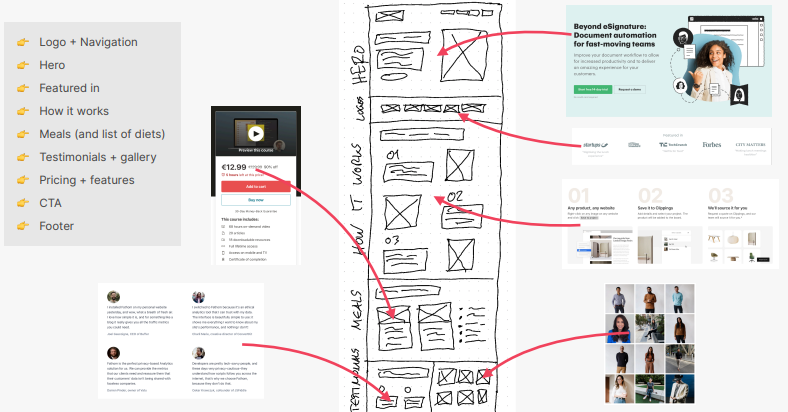

## SKETCH LAYOUT AND COMPONENT IDEAS

- Think about what components are required
- Commonly used layout patterns

## SKETCH WEBSITE ON PAPER

- To get ideas iteratively
- No need for verbosity in sketches, just a planned structure

